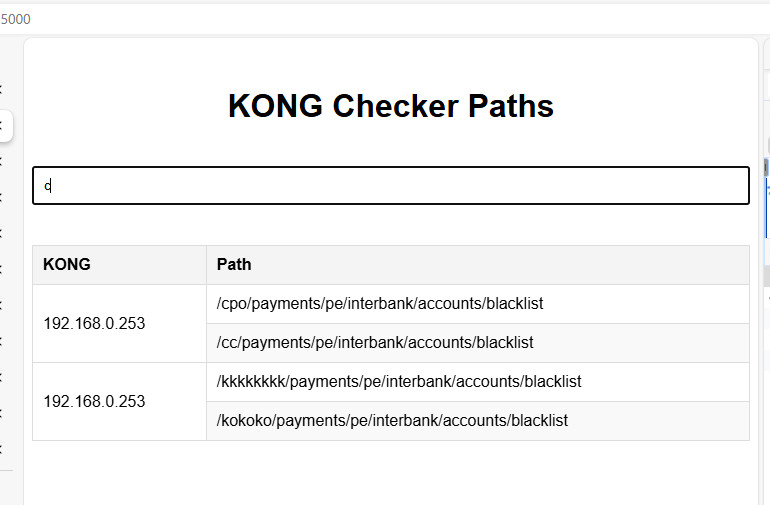

# KONG Checker Path

The tool to get all paths that configured in KONGs.



## Create a virtual environment 
```
python -m venv env
```

## Activate the virtual environment

### Windows
```
env\Scripts\activate
```

### macOS and Linux
```
source env/bin/activate
```

## Development

```
pip install -r requirements.txt
python app.py
```

`.env`

List of KONG routes
```
API_URLS=http://192.168.0.253:8080/kong/1.json,http://192.168.0.253:8080/kong/2.json
```

## Deployment